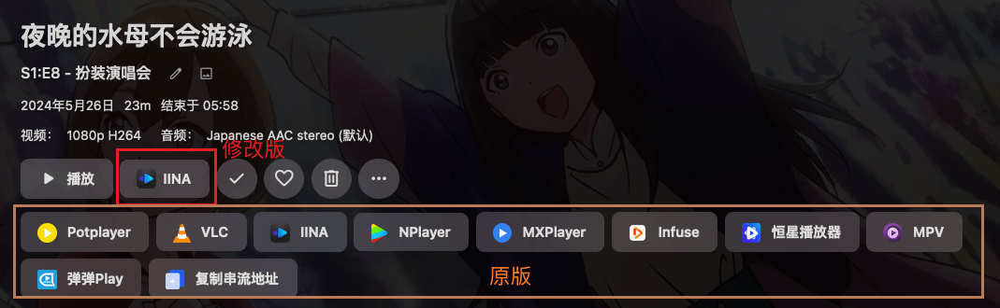
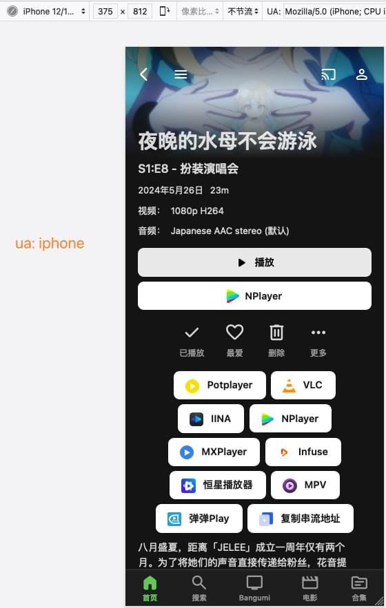

## emby 调用 iina

**自用脚本, 可能有bug**

> 修改自  https://greasyfork.org/en/scripts/459297
>
> 合并大佬最新仓库代码 https://github.com/bpking1/embyExternalUrl

### 问题反馈

https://github.com/jqtmviyu/UserScripts/issues

### 功能

* 根据ua显示不同的播放器
* macos: iina
* 移动端: nplayer
* window: pot
* 其他: vlc
* 调用播放器60秒后自动标记为已播放

### 安装

* pc浏览器: 油猴/暴力猴 安装脚本
* 移动端: via/x/firefox 支持安装脚本
* 服务端: 使用 Emby.CustomCssJS 或者 把容器里的`/system/dashboard-ui/index.html`拷贝添加``再映射回去

### 截图

相关脚本:

* [emby首页轮播图](https://github.com/jqtmviyu/UserScripts)